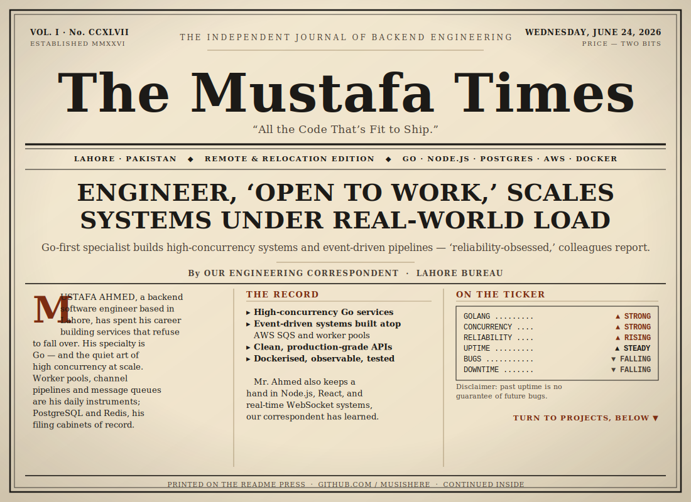

<!-- ════════════════════════════════════════════════════════════════ -->
<!--   THE MUSTAFA TIMES · profile README                              -->
<!--   Asset SVGs live in ./assets — keep them next to this file.     -->
<!-- ════════════════════════════════════════════════════════════════ -->

<div align="center">



<a href="https://github.com/musishere">
  
</a>

</div>

<br/>

<!-- ───────────────────────────  PROJECTS  ─────────────────────────── -->


> **SCALABLE SPORTS BACKEND** — *A high-concurrency Go service handles the crowd without breaking a sweat.*
> `Go` · `AWS SQS` · `PostgreSQL` · `Docker` — Worker pools, channel pipelines, and event-driven message processing over SQS. **[Read the full story → »](https://github.com/musishere)**

> **REAL-TIME CHAT APP** — *Thousands converse at once; presence stays live, sources confirm.*
> `Node.js` · `Socket.IO` · `React` — Multi-room chat with live presence, private messaging, and WebSocket concurrency handling. **[Read the full story → »](https://github.com/musishere)**

> **E-COMMERCE PLATFORM** — *Full-stack storefront opens its doors to the public.*
> `Node.js` · `MongoDB` · `React` — Product management, cart, JWT auth, and MVC-structured REST APIs. **[Read the full story → »](https://github.com/musishere)**

> **LMS BACKEND** — *Modular course system enrolls students by the hundred.*
> `Node.js` · `PostgreSQL` — Course management with enrollment tracking and layered API validation. **[Read the full story → »](https://github.com/musishere)**

<br/>

<!-- ──────────────────────────  TECH STACK  ────────────────────────── -->


<div align="center"><sub><i>Closing positions as of the latest commit. Past performance is no guarantee of future bugs.</i></sub></div>

| COMMODITY | SECTOR | POSITION | TREND |
|:---|:---|:---|:---:|
| **Go (Golang)** | Languages | Primary holding | ▲ Strong Buy |
| **Node.js** | Runtime | Core position | ▲ Buy |
| TypeScript / JavaScript | Languages | Accumulating | ▲ Buy |
| Gin · Fiber | Go Frameworks | Long | ▲ Buy |
| Express · React | Web Frameworks | Held | ◆ Hold |
| PostgreSQL | Databases | Primary holding | ▲ Buy |
| MongoDB · MySQL | Databases | Long | ◆ Hold |
| Redis | Cache & Queues | Long | ▲ Buy |
| AWS · SQS | Cloud | Core position | ▲ Buy |
| Docker · Git | DevOps & Tooling | Always long | ▲ Buy |

<sub><b>ALSO TRADING:</b> REST APIs · Clean Architecture · Microservices · WebSockets · JWT</sub>

<br/>

<!-- ─────────────────────────  EDITOR'S DESK  ──────────────────────── -->


```go
package main

import "fmt"

type Engineer struct {
	Name         string
	Speciality   string
	CurrentFocus []string
	OpenTo       string
}

func main() {
	me := Engineer{
		Name:       "Mustafa Ahmed",
		Speciality: "Go Backend & Distributed Systems",
		CurrentFocus: []string{
			"High-concurrency Go services",
			"Event-driven architectures (SQS, worker pools)",
			"Clean, production-grade API design",
		},
		OpenTo: "Remote or relocation — worldwide",
	}

	fmt.Printf("%s is %s 🗞️\n", me.Name, me.OpenTo)
	// hire me
}
```

<br/>

<!-- ─────────────────────────  BY THE NUMBERS  ─────────────────────── -->


<div align="center">


</div>

<br/>

<!-- ───────────────────────────  ON THE WIRE  ─────────────────────── -->


<div align="center">


</div>

<br/>

<!-- ───────────────────────────  CLASSIFIEDS  ─────────────────────── -->


> **SITUATIONS WANTED.** Backend engineer, Go-first, seeks demanding work building high-concurrency, distributed, and event-driven systems. Remote or relocation considered — worldwide. Excellent references (uptime) available on request. **Enquire at the desk below. ▾**

<div align="center">

[](mailto:mustafabukhari333@gmail.com)
&nbsp;
[](https://github.com/musishere)
&nbsp;
[](https://www.linkedin.com/in/mustafa-ahmed-012675279/)

<br/><br/>

<sub><i>The Mustafa Times · Printed daily on the README Press · Lahore, Pakistan</i></sub>

<br/>

**— 30 —**

</div>
